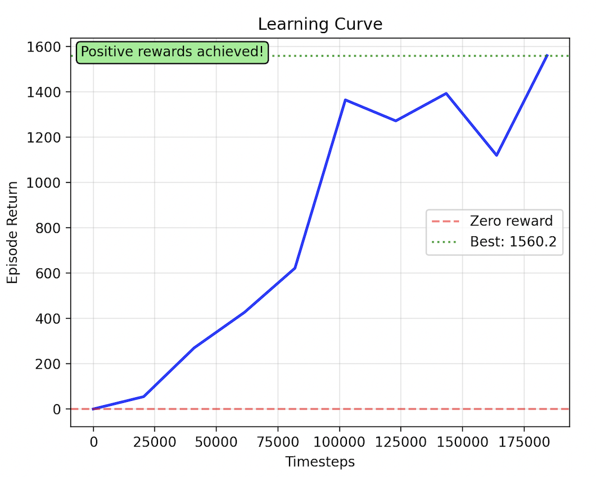
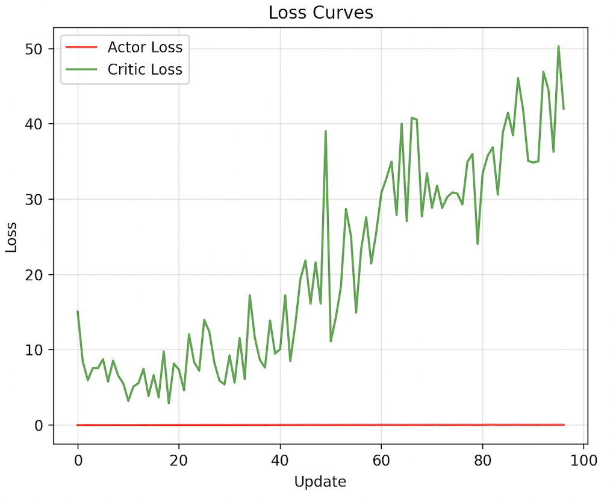
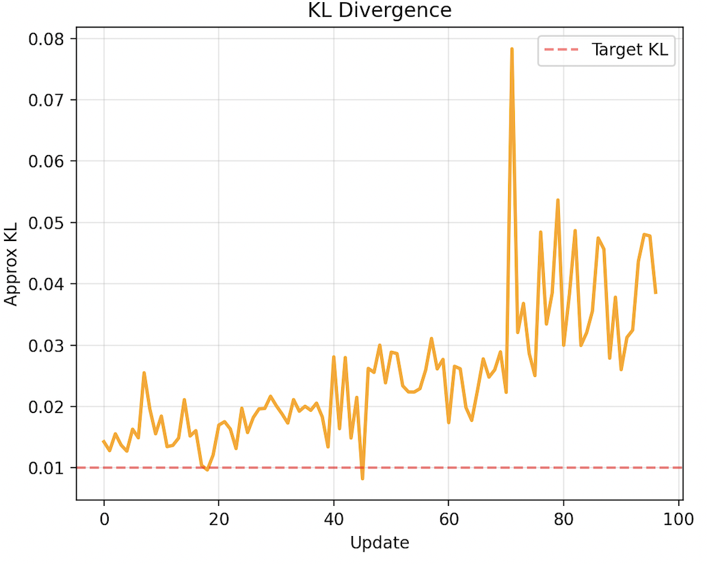
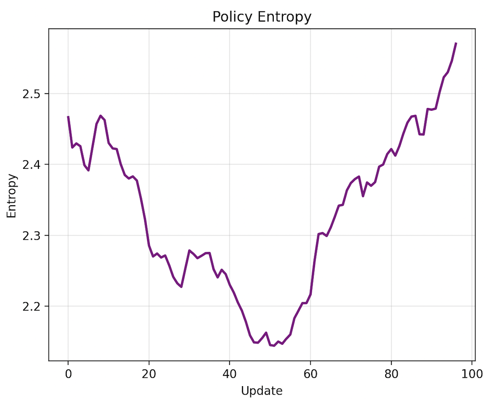
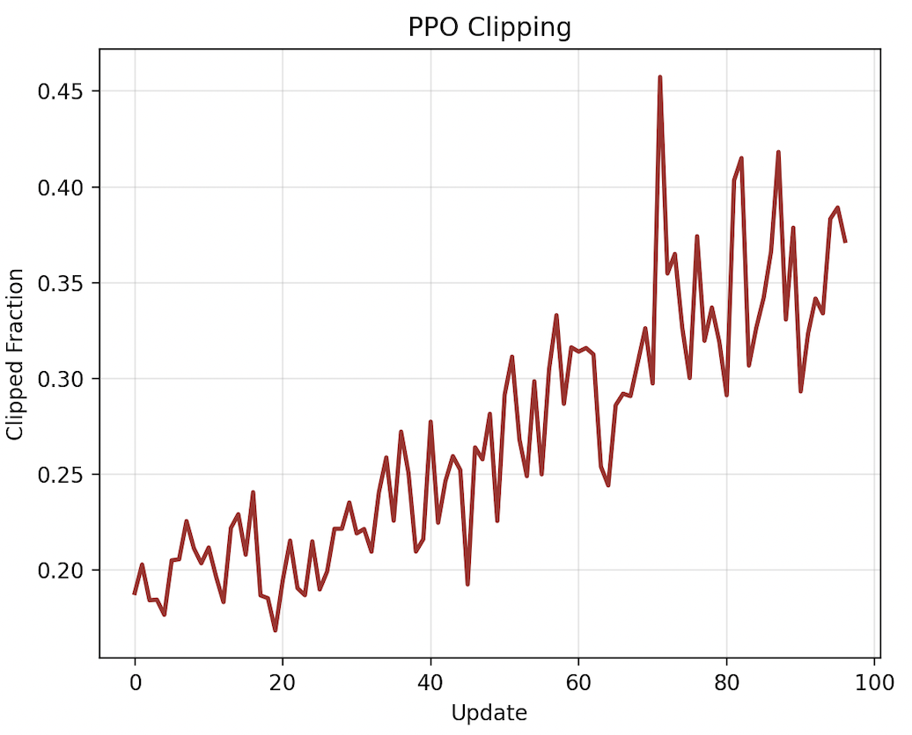
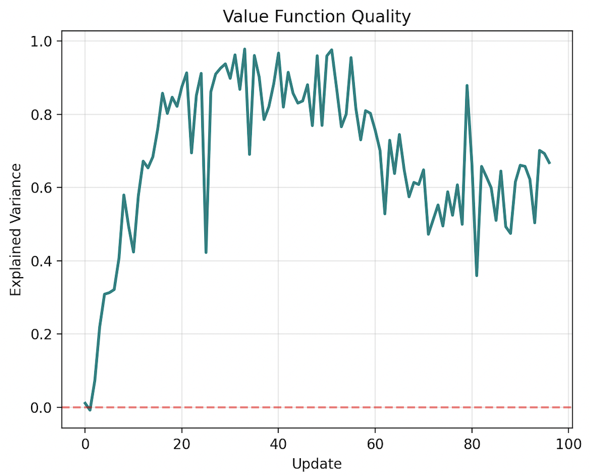

# PPO in JAX

> [!IMPORTANT]
> This implementation is for educational purposes, which means it is not for any production stuff but it covers all core components of Proximal Policy Optimization (PPO).

### Proximal Policy Optimization

At its core, PPO is a policy gradient reinforcement learning algorithm that learns to take better actions in an environment by preventing destructively large policy updates. It uses a clipped surrogate objective function to maintain policy stability while maximizing rewards.

#### Algorithm

PPO combines the sample efficiency of Actor-Critic methods with the stability of Trust Region Policy Optimization (TRPO). The key innovation is using a clipped objective function that prevents the new policy from deviating too far from the old policy.

### Configuration

```python
@dataclass
class PPOConfig:
    """Hyperparams for PPO Algo"""

    learning_rate: float = 3e-4
    gamma: float = 0.99
    gae_lambda: float = 0.95
    clip_epsilon: float = 0.2
    value_coeff: float = 0.5
    entropy_coeff: float = 0.01
    max_grad_norm: float = 0.5
    n_epochs: int = 10
    batch_size: int = 64
    n_steps: int = 2048
```

### Network Architecture

```python
def init_network_params(key, obs_dim, action_dim, hidden_dim=64):
    """Initialize shared Actor-Critic network"""

    # Shared layers
    w1 = random.normal(k1, (obs_dim, hidden_dim)) * sqrt(2.0 / obs_dim)
    w2 = random.normal(k2, (hidden_dim, hidden_dim)) * sqrt(2.0 / hidden_dim)

    # Actor head (policy network)
    w_actor = random.normal(k3, (hidden_dim, action_dim)) * 0.01
    log_std = jnp.ones(action_dim) * -1.0  # Initial std = 0.37

    # Critic head (value network)
    w_critic = random.normal(k4, (hidden_dim, 1)) * 0.01

    return params
```

### Training

```python
def train_ppo(env_name="HalfCheetah-v5", total_timesteps=500_000):
    """Main PPO training loop"""

    config = PPOConfig(
        learning_rate=3e-4,
        n_steps=2048,
        batch_size=64,
        n_epochs=10,
        clip_epsilon=0.2,
        gamma=0.99,
        gae_lambda=0.95
    )

    env = gym.make(env_name)
    agent = PPOAgent(obs_dim, action_dim, config)

    for iteration in range(total_timesteps // config.n_steps):
        # Collect rollout data
        rollout = collect_rollout(agent, env, key, config.n_steps)

        # Update policy using PPO loss
        agent.update(rollout)

        # Evaluate performance
        if iteration % eval_freq == 0:
            avg_return = evaluate(agent, env, n_episodes=10)
            print(f"Iteration {iteration}: {avg_return:.2f}")

    return agent
```

### Key Features

- **Actor-Critic Architecture**: Shared network with separate heads for policy and value estimation
- **Generalized Advantage Estimation (GAE)**: Reduces variance in advantage computation
- **Clipped Surrogate Objective**: Prevents destructive policy updates
- **Continuous Action Spaces**: Uses Gaussian policy for continuous control
- **Pure JAX Implementation**: Leverages JAX's JIT compilation and automatic differentiation

### Environment

The implementation is tested on MuJoCo continuous control environments:

- HalfCheetah-v5
- Walker2d-v5
- Hopper-v5
- Ant-v5

### Training Results

#### Learning Curve



The learning curve shows the agent's episodic returns over training timesteps. Starting from near-zero performance, the agent rapidly improves and achieves positive rewards around 75k timesteps, reaching a best performance of 1560.2. The curve shows typical RL training dynamics with some variance but clear upward trend.

#### Loss Curves



The loss curves track both actor and critic losses during training. The actor loss (red) remains relatively stable near zero, indicating well-behaved policy updates thanks to PPO's clipping mechanism. The critic loss (green) shows more variation as the value function adapts to changing state values, with an overall increasing trend as the agent encounters more valuable states.

#### KL Divergence



KL divergence measures how much the policy changes between updates. The plot shows KL staying mostly below the target threshold (dashed red line at 0.01), with occasional spikes around update 75 when the agent makes significant policy improvements. This demonstrates PPO's ability to prevent destructive policy updates.

#### Policy Entropy



Policy entropy tracks exploration behavior. Starting high (~2.45), entropy decreases as the policy becomes more deterministic around update 40, then increases again after update 60 as the agent explores new promising regions. This U-shaped pattern is common in successful RL training.

#### PPO Clipping



The clipping fraction shows what percentage of training samples hit PPO's clipping bounds. Starting around 20%, it increases to 30-45% as training progresses, indicating the policy is making increasingly aggressive updates that get clipped for stability.

#### Value Function Quality



Explained variance measures how well the value function predicts actual returns (1.0 = perfect, 0.0 = no correlation). The metric quickly rises to ~0.9, indicating the critic learns good value estimates. Some degradation occurs later in training as the environment distribution shifts with the improving policy.

### Run

Install dependencies:

```bash
uv sync
```

Train the agent:

```bash
uv run python train.py
```

### References

- [1] [Proximal Policy Optimization Algorithms](https://arxiv.org/abs/1707.06347) - Schulman et al.
- [2] [High-Dimensional Continuous Control Using Generalized Advantage Estimation](https://arxiv.org/abs/1506.02438) - Schulman et al.
- [3] [The 37 Implementation Details of Proximal Policy Optimization](https://iclr-blog-track.github.io/2022/03/25/ppo-implementation-details/) - Huang et al.
